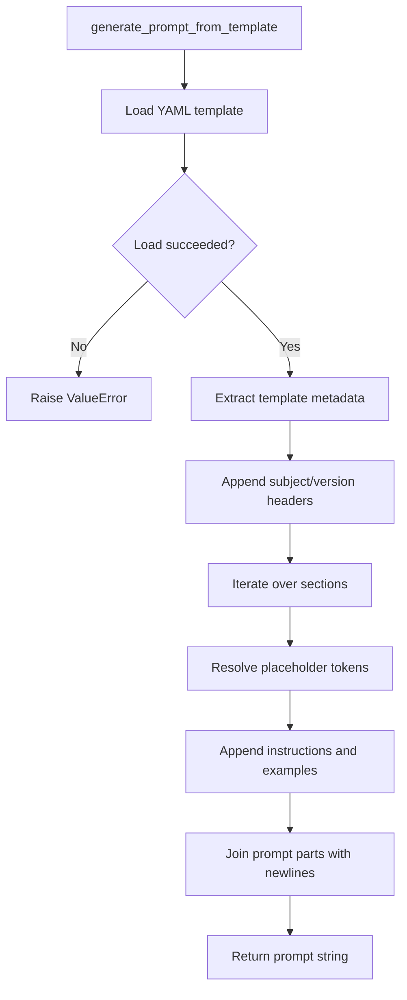

# BMAD Python SDK Review and Documentation

## Executive Summary

- **Purpose**: Provide a comprehensive review of the current BMAD Python SDK and outline a pathway toward a production-ready integration with the Google Agents ADK.
- **Scope**: Covers the SDK modules in `bmad_python_sdk`, their responsibilities, integration touchpoints (agent definitions, workflow YAML, prompt templates), and recommendations for future work.
- **Audience**: BMAD maintainers, contributors extending the Python SDK, and stakeholders evaluating roadmap priorities.

## Current Capabilities

- `agents.Agent` loads persona, command, dependency, and metadata sections from markdown-based agent definitions to bootstrap runtime personas used in workflow steps.【F:bmad_python_sdk/agents.py†L9-L43】
- `workflow.Workflow` orchestrates YAML-defined sequences, instantiates agents on demand, logs execution, and simulates artifact hand-offs by updating an in-memory context.【F:bmad_python_sdk/workflow.py†L5-L97】
- `prompts.generate_prompt_from_template` converts structured YAML templates into human-readable instructions with contextual substitutions and example lists.【F:bmad_python_sdk/prompts.py†L4-L54】
- `example.py` demonstrates end-to-end usage by simulating the "Greenfield Full-Stack" workflow and rendering a PRD prompt from templates.【F:example.py†L1-L47】

## Architecture Overview

### Workflow Execution Flow

```mermaid
flowchart TD
    A[Start Workflow.run()] --> B[Load workflow YAML definition]
    B --> C{Sequence available?}
    C -- No --> Z[Return "Workflow sequence is not defined."]
    C -- Yes --> D[Iterate over steps]
    D --> E{Step has agent?}
    E -- No/"various" --> F[Log contextual step notes]
    F --> D
    E -- Yes --> G[Normalize complex agent specifiers]
    G --> H[Build path to agent markdown]
    H --> I{Agent definition loads?}
    I -- No --> J[Log missing agent message]
    J --> D
    I -- Yes --> K[Instantiate Agent and read persona]
    K --> L[Record artifact creation/requirements]
    L --> M[Simulate artifact creation in context]
    M --> D
    D --> N[Append "Workflow finished."]
    N --> O[Return execution log]
```

### Prompt Generation Flow



## Product Requirements Document (PRD)

### Background & Problem Statement

BMAD aims to orchestrate specialized AI agents through codified workflows. The existing Python SDK provides a simulation layer but lacks production-ready hooks into the Google Agents ADK, robust validation, and developer tooling. Stakeholders require clarity on how to evolve this SDK from demonstration to operational software.

### Goals

1. Deliver a Python package that can parse BMAD assets (agents, workflows, templates) and drive multi-agent interactions through the Google Agents ADK.
2. Provide extensible abstractions for persona-specific prompt generation, artifact lifecycle management, and state sharing between agents.
3. Offer documentation, tests, and CLIs that make it easy for teams to adopt and customize BMAD workflows.

### Non-Goals

- Building a fully autonomous agent execution environment beyond ADK integration.
- Replacing the existing JavaScript SDK or other platform implementations.
- Implementing production-grade UI/UX surfaces; focus remains on SDK functionality.

### Target Users & Use Cases

- **Internal BMAD Maintainers**: Iterate rapidly on workflow definitions, validate templates, and ensure parity between SDKs.
- **Solution Engineers / Integrators**: Embed BMAD workflows into customer solutions, customizing agents and prompts.
- **AI Researchers**: Experiment with persona variations and context passing to evaluate outcomes.

### Functional Requirements

1. Load and validate agent markdown files, exposing persona metadata and executable command contracts.
2. Parse workflow YAML, resolve agent dependencies, and manage shared context/state objects.
3. Generate prompts from templates with error handling, placeholder substitution, and extensible formatting hooks.
4. Execute steps via the ADK with retry policies, structured outputs, and artifact persistence.
5. Provide CLI commands for running workflows, inspecting agents/templates, and generating docs.
6. Offer API surface for injecting custom agents, connectors, and telemetry.

### Success Metrics

- **Usability**: New integrators can execute a workflow end-to-end within 30 minutes using documentation and CLI.
- **Reliability**: Workflow execution succeeds in 95% of runs with validated assets; failures emit actionable errors.
- **Extensibility**: Adding a new agent template requires touching no more than two files (definition + optional subclass).
- **Adoption**: At least three internal teams integrate the SDK with their own workflows during pilot phase.

### Risks & Mitigations

| Risk                             | Impact | Mitigation                                                                        |
| -------------------------------- | ------ | --------------------------------------------------------------------------------- |
| Divergence from core BMAD assets | Medium | Establish schema validation and CI tests ensuring compatibility with `bmad-core`. |
| ADK API changes                  | High   | Encapsulate ADK interactions behind interface layer with version negotiation.     |
| Complex workflow branching       | Medium | Introduce graph-aware execution engine and state snapshots.                       |
| Prompt template brittleness      | Medium | Provide schema + linting to catch placeholder mismatches pre-runtime.             |

## Detailed Technical Specification

### Module Responsibilities

| Module                     | Responsibility                                                                                                              | Key Types & Functions                                                                                                                                                                                                 |
| -------------------------- | --------------------------------------------------------------------------------------------------------------------------- | --------------------------------------------------------------------------------------------------------------------------------------------------------------------------------------------------------------------- |
| `bmad_python_sdk.agents`   | Load agent definitions, expose persona metadata, and provide prompt hooks for subclasses.                                   | `Agent` constructor loads markdown YAML, storing `persona`, `commands`, `dependencies`, and `agent_info`. `get_prompt` currently returns a basic role-based instruction string.【F:bmad_python_sdk/agents.py†L9-L61】 |
| `bmad_python_sdk.workflow` | Parse workflow YAML, iterate through steps, instantiate `Agent` objects, and track simulated artifacts in a shared context. | `Workflow.__init__` loads sequence data; `run` handles complex agent specifiers, missing definitions, and context updates while logging progression.【F:bmad_python_sdk/workflow.py†L9-L97】                          |
| `bmad_python_sdk.prompts`  | Build textual prompts from YAML templates, supporting placeholder substitution and optional examples.                       | `generate_prompt_from_template` loads YAML, iterates sections, resolves placeholders, and concatenates segments into a prompt string.【F:bmad_python_sdk/prompts.py†L4-L54】                                          |

### Data Inputs

- **Agent Markdown**: Markdown files containing fenced YAML with `agent`, `persona`, `commands`, and `dependencies` sections. Parsed via `yaml.safe_load` after extracting fenced block.【F:bmad_python_sdk/agents.py†L24-L43】
- **Workflow YAML**: Defines `workflow.sequence` arrays with `agent`, `creates`, `requires`, and `notes` metadata guiding orchestration.【F:bmad_python_sdk/workflow.py†L22-L94】
- **Template YAML**: Contains metadata and `sections` arrays; each section includes `title`, `instruction`, and optional `examples`.【F:bmad_python_sdk/prompts.py†L25-L51】

### Extension Points

- **Agent Specialization**: Subclass `Agent` to override `get_prompt` and provide richer prompt logic per agent persona.
- **Workflow Execution Backend**: Replace the simulation block in `Workflow.run` with ADK invocations; maintain context mutation contract.【F:bmad_python_sdk/workflow.py†L82-L89】
- **Template Engines**: Enhance placeholder resolution, support conditional sections, or integrate with Jinja-like rendering while preserving YAML source of truth.【F:bmad_python_sdk/prompts.py†L32-L52】

### Observability & Validation

- Introduce schema validation for agent/workflow/template inputs using `pydantic` or `jsonschema` to fail early on malformed assets.
- Emit structured logs/events for each workflow step, capturing agent IDs, artifacts, and errors for downstream monitoring.
- Add unit/integration tests covering asset parsing, placeholder replacement, and workflow branching scenarios.

## Minimum Viable Implementation Plan

1. **Hardening Phase (Week 1-2)**
   - Add schema validation utilities for agent, workflow, and template inputs.
   - Expand unit tests in `bmad_python_sdk/tests` to cover validation and error cases.
   - Document supported schemas and sample assets.
2. **ADK Integration (Week 3-4)**
   - Create an `ExecutionBackend` interface and wire `Workflow.run` to delegate step execution.
   - Implement a Google Agents ADK backend with retry logic, structured outputs, and context merging.
   - Provide mock backend for testing.
3. **Developer Experience Enhancements (Week 5)**
   - Build CLI commands for running workflows, validating assets, and generating prompts.
   - Publish comprehensive guides (quickstart, reference) linked from repository docs.
4. **Pilot & Feedback (Week 6)**
   - Run pilot workflows with internal stakeholders, collect feedback, and iterate on usability gaps.
   - Instrument telemetry/logging to capture run metrics and errors.

## Appendices

- **Related Assets**: `bmad-core/agents`, `bmad-core/workflows`, `bmad-core/templates`.
- **Reference Example**: `example.py` demonstrates the current SDK surface for workflow simulation and prompt generation.【F:example.py†L1-L47】
